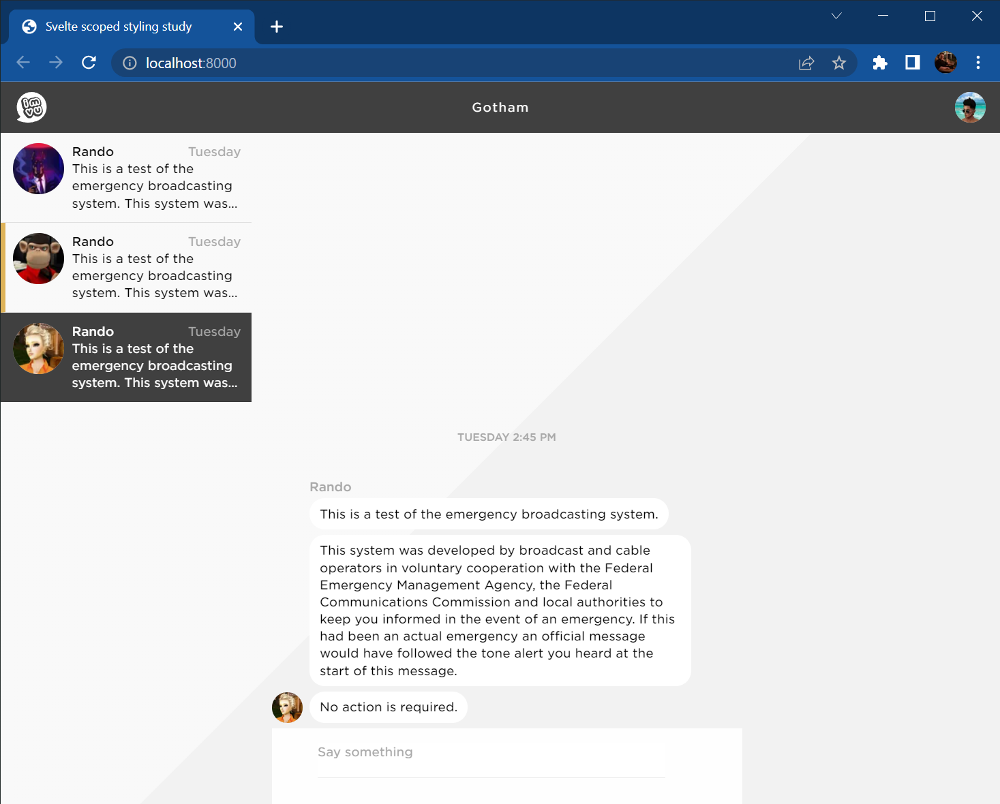

# Overview

Use Node.js 16.14.2. Clone this repository and run `npm install`.

Each example is tagged. Use `git checkout v1`, `v2`, `v3`, or `v4` to switch between them. Use `git checkout main` to switch back to master.

* The `code/` directory contains all of the source code.
* The `build/` directory contains all of the build output.
* The `public/` directory is where files are served from, similar to `localhost.imvu.com`. Some files are copied into here from both the `code/` and `build/` directories.
* `s/build` will build the project, part of which includes "deploying" into `public/`.
* `s/dev` will build the project and start a dev server at http://localhost:8000 that will auto-rebuild and refresh the page as you save changes to files. It implements primitive "hot modules reloading".

# Svelte styling intro

IMVU attempts to isolate component styling informally by namespacing. For example, `ProfileIcon.scss` will put all of its styles under a `.profile-icon` rule. In practice, any style in any component may override another because CSS combines all styles globally by design. This total freedom complicates the implementation and maintenance of the application when the styles for any given component of interest are scattered across many files, and especially when they exist in unexpected locations.

Svelte makes each component the boss of its own styles. Nobody else can style a component without its permission: A message list component cannot override the styles of its message list item components or vice versa. The message drawer component cannot override the styles of either. As a result, styles within a component could be considered more stable because it is more difficult for them to be accidentally disrupted by outside influences.

If nobody can style a Svelte component without its permission, how is permission given? The component has at least two options:

1. It can use an escape-hatch syntax that allows it to inherit global styles.
2. It can accept styling suggestions from outside sources.

The first option invites accidental regressions per usual. The second option means that if a component is intended to be able to display itself in various formats, then it should know about all of them and be solely responsible for enforcing them. Svelte components can use "props" to accept input, like styling suggestions, from outside sources. With all the styling for a component occurring in only one place that has a well-defined input, debugging is simplified.

This styling intro demonstrates how to turn IMVU styles into Svelte styles incrementally.

# Example 1

To follow along, run:

```shell
git checkout v1
```

`App.svelte` contains a small mockup of the IMVU website with all of the markup and styles combined, except for `globalCSS.css` which contains similar boilerplate styling. Pretend that the content of `App.svelte` is the result of building our existing website. It represents the bundled markup and styling for the global nav, conversation list, message list, message list item, chat bubble, and profile icon components.

Profile icons appear in three places:

1. the global nav
2. the conversation list, and
3. the message list.

Examine how they are styled and note that `.profile-icon` has its own styles. Also note that each of these three areas override the profile icon's styles in different ways:

* shifting its layout via margin
* changing its size
* shifting its layout via absolute positioning

In this example, all of these overrides have been placed in a single file and are relatively easy to debug. In the real IMVU codebase, the overrides are scattered across the file system. If you are styling a new component or fixing a styling regression on an existing component, you may or may not know where to look when its styles seem to be getting undesirably influenced by outside sources. If you are new to IMVU, you may struggle to find those sources. Even veterans may struggle!

Start the dev server and examine the overall layout.

# Example 2

Run:

```shell
git checkout v2
```

In this example, the profile icon has been converted into a Svelte component as `ProfileIcon.svelte`. Start the dev server and notice how the profile icon styles have been disrupted in every location:

* The global nav profile icon is now flush against the right edge of the page.
* The conversation list profile icons are now crammed into the right-hand text.
* The message list profile icon is now crammed inbetween the chat bubbles.

These are all real styling regressions that you are likely to encounter when converting IMVU's components to Svelte components.

If you read `ProfileIcon.svelte` closely, you'll notice that `profile-icon` was renamed to `sv-profile-icon`. There is an important reason for this: Incrementally adopting Svelte means that all of our existing styles will bleed into the new Svelte components, negating the benefits of Svelte's scoped styling. A "pure Svelte" application does not have this problem but we do.

Start the dev server and remove the `sv-` prefix and notice how all of the styling is restored. Why add this prefix if it breaks our styling? It's because it will help us adapt to the Svelte way of styling components, which is naturally resistant toward accidental regressions. Preventing the IMVU website styling from bleeding through into the Svelte components is an important first step. Adding prefixes is an easy way to achieve this.

The next example will demonstrate how to fix the styling in a Svelte-friendly way.

# Example 3

Run:

```shell
git checkout v3
```

In this example, the profile icon styles have all been repaired. The strategy is simple: Add a wrapper element around every `<ProfileIcon />` and style the wrapper instead.

Note that Svelte components do not receive and automatically apply HTML element attributes such as:

```svelte
<ProfileIcon class="large" />
```

The reason why is because Svelte components can contain arbitrary HTML with multiple elements at the top level. They are not like IMVU components which always have a single root element. With multiple elements at the top level, which would receive `class="large"`? One of them? All of them? It is ambiguous and so Svelte does not behave this way.

Any attributes you specify on a Svelte component are considered props. If you pass in a prop that a Svelte component does not `export`, it will be ignored. Further, since `class` is a keyword in JavaScript, you cannot `export` a prop of that name. Start the dev server and try to do so in `ProfileIcon.svelte`.

You may be tempted to pass in a prop named `classes` and then apply those classes to one or more elements. This does work and those classes will still be scoped by Svelte. But consider that CSS classes are generally used as a styling implementation detail. If you instead treat props as higher-level flags or tags, then they can be leveraged for any purpose. For example, `<ProfileIcon large={true} />` or `<ProfileIcon format="large" />`. A component can make any number of decisions internally about what elements to include or how to style them based on its props.

# Example 4

Run:

```shell
git checkout v4
```

In this example, the profile icon styles have all been repaired in a more holistic fashion. Meaning, instead of putting everything inside a wrapper, the structure and semaantics of the document are changed in addition to changing the styles.

The changes in this example are not intended to point out the "correct" way to repair the styles. They aim only show an alternative to wrappers. Modifications such as these may be much more time-consuming and so the benefits should be weighed against the cost. For the quickest and simplest migration, use wrappers. Prefer a more holistic solution only when it seems likely that it will have a tangible benefit, such as improved performance, accessibility, or maintainability.
